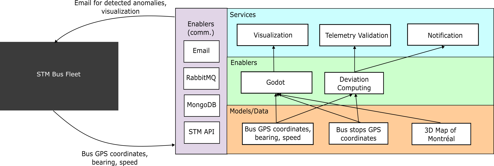

# Société de Transport de Montréal Bus Digital Twin
Project for a digital twin (DT) for the Société de Transport de Montréal (STM) bus routes monitoring

## Pre-Requisites

1. [Git](https://git-scm.com/)
2. [Python](https://www.python.org/)
3. [Jupyter](https://jupyter.org/)
4. [Docker](https://www.docker.com/)
5. [RabbitMQ](https://www.rabbitmq.com/)
6. [MongoDB](https://www.mongodb.com/)
7. [Godot](https://godotengine.org/)

## Architecture




## STM API Data
- The STM API uses the [GTFS](https://gtfs.org/) protocol for data exchange.
- The data dictionary for the API can be found [here](https://developers.google.com/transit/gtfs-realtime/reference?hl=en)


## STM API OAuth

The Digital Twin requires an API key for the [STM API](https://portail.developpeurs.stm.info/apihub/#/login). After sign up and getting an account ready,
[create an application](https://portail.developpeurs.stm.info/apihub/#/applications/create) within the API portal to get access to an API Key.

- For `Mac/Linux`:
1. Run the command in your terminal, replacing `APIKey` with your API key:
```
echo "export STM_API_KEY='APIKey'" >> ~/.zshrc
```
2. Update the shell with the new variable by running the command:
```
source ~/.zshrc
```
3. Confirm that you have set your environment variable by running the following command and checking the output:
```
echo $STM_API_KEY
```

- For `Windows`:
1. Run the command in your terminal, replacing `APIKey` with your API key:
```
export STM_API_KEY=APIKey
```


## Run Data Ingestion Service

- Navigate to the `root` folder of the project and run the command to install all Python dependencies:
```
pip install -r requirements.txt
```

- Then, navigate to the `software` folder and run the command to start the `data ingestion service`:
```
python -m startup.start_data_ingestion_service
```

- or, add the parameter after the module script to the command to run the `data ingestion service` for a select number of bus routes, i.e.: buses `121, 45, and 41` only:
```
python -m startup.start_data_ingestion_service "121, 45, 41"
```


## Run Telemetry Service

- Open a terminal window and launch `Jupyter Notebook`;
- On the Jupyter tree browser page navigate to the `services` folder of the project;
- Run the cells on [`Telemetry-Valdiation-Service`](services/Telemetry-Validation-Service.ipynb) notebook;


## Run Notification Service

- Open a terminal window and launch `Jupyter Notebook`;
- On the Jupyter tree browser page navigate to the `services` folder of the project;
- Follow the steps to launch the [`Telemetry-Valdiation-Service`](services/Telemetry-Validation-Service.ipynb) first;
- Once sure that the `Telemetry-Valdiation-Service` service is running, then navigate to [`Notification-Service.ipynb`](services/Notification-Service.ipynb) notebook;
- Run the cells on the notebook;
- Update values in the [configuration file](services/startup.conf) to send the emails to an account other than the default.


## Run Visualization Service

- Complete the `Run Data Ingestion Service` step
- Open visualization/project.godot with Godot 4.4.1 (C#/.NET version)
- Press the play button (the button is onn the top right corner of the window)


## Authors

- [Vanny Katabarwa](mailto:vanny-nicole.kayirangwa-katabarwa@polymtl.ca?subject[Github]%LOG6953FE-STM-Digital%Twin)
- [Kerian Fiter](mailto:kerian.fiter@polymtl.ca?subject[Github]%LOG6953FE-STM-Digital%Twin)
- [Carlos Pambo](mailto:carlos.pambo@polymtl.ca?subject[Github]%LOG6953FE-STM-Digital%Twin)